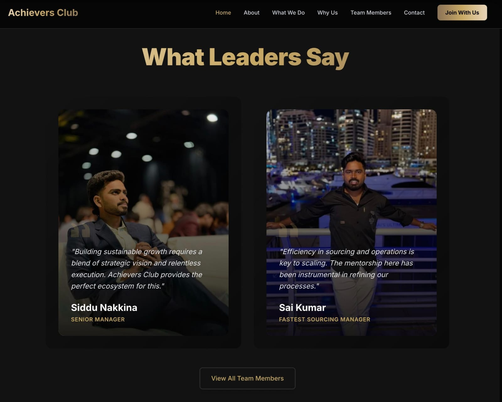

# 🚀 Achievers Club - Official Portfolio



> **Building Forever Achievers.**  
> An elite community ecosystem for ambitious business leaders, featuring strategic frameworks, proven methodologies, and extensive networking opportunities.

---

## 🌟 Overview

This project is a high-performance, visually stunning web application built for **Achievers Club**. It showcases the community's mission, success stories, and membership benefits through a premium, dark-themed interface with smooth animations and interactive elements.

## 🛠️ Tech Stack

This project is built with a modern, performance-focused stack:

### **Frontend Core**
*    **React 18** - Component-based UI library.
*    **Vite** - Next-generation frontend tooling for blazing fast builds.
*    **Tailwind CSS** - Utility-first CSS framework for rapid styling.

### **Animations & UI**
*    **Framer Motion** - Production-ready animation library for React.
*    **Lucide React** - Beautiful & consistent icons.
*   **Glassmorphism** - Custom CSS utilities for premium glass-like effects.

### **Backend & Data**
*    **Supabase** - Open source Firebase alternative for database and authentication.

---

## ✨ Key Features

*   **🎨 Premium Dark Aesthetic**: A carefully curated gold-on-black theme with gradients and glassmorphism.
*   **⚡ High Performance**: Optimized with Vite and code-splitting for instant load times.
*   **🎭 Smooth Animations**:
    *   Scroll-triggered reveals.
    *   Parallax hero sections.
    *   3D card tilts and hover effects.
*   **📱 Fully Responsive**: Flawless experience across mobile, tablet, and desktop devices.
*   **👥 Dynamic Team Section**: Interactive team grids with role-based highlighting.
*   **📝 Contact Integration**: Functional contact forms connected to Supabase for real-time data capture.

---

## 🚀 Getting Started

Follow these steps to set up the project locally:

### Prerequisites
*   Node.js (v16 or higher)
*   npm or yarn

### Installation

1.  **Clone the repository**
    ```bash
    git clone https://github.com/yourusername/achievers-club.git
    cd achievers-club
    ```

2.  **Install dependencies**
    ```bash
    npm install
    ```

3.  **Environment Setup**
    Create a `.env` file in the root directory and add your Supabase credentials:
    ```env
    VITE_SUPABASE_URL=your_supabase_url
    VITE_SUPABASE_ANON_KEY=your_supabase_anon_key
    ```

4.  **Run the development server**
    ```bash
    npm run dev
    ```
    The app will align at `http://localhost:5173`.

---

## 📂 Project Structure

```bash
src/
├── components/      # Reusable UI components (Buttons, Cards, etc.)
├── pages/           # Main route pages (Home, About, Contact, etc.)
├── lib/             # Utility libraries (Supabase client)
├── utils/           # Helper functions (twMerge, clsx)
├── index.css        # Global styles and Tailwind directives
└── App.jsx          # Main application entry point
```

---

## 🤝 Contributing

Contributions are welcome! Please feel free to submit a Pull Request.

1.  Fork the project
2.  Create your feature branch (`git checkout -b feature/AmazingFeature`)
3.  Commit your changes (`git commit -m 'Add some AmazingFeature'`)
4.  Push to the branch (`git push origin feature/AmazingFeature`)
5.  Open a Pull Request

---

## 📄 License

Distributed under the MIT License. See `LICENSE` for more information.

---

<div align="center">
  <p>Built with ❤️ for <strong>Achievers Club</strong></p>
</div>
